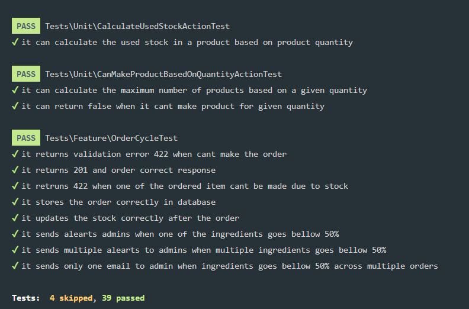

# Foodics Coding Challenge

This is a coding challenge for Foodics Senior PHP Developer. The challenge is to build a web application that allows users manage their own restaurant stock.

## Installation

1. Clone the repository

    ```bash
    git clone https://github.com/nagi1/foodics-coding-challenge.git
    ```

2. Install the dependencies

    ```bash
    composer install
    ```

3. Copy the `.env.example` file to `.env` and update the database credentials

    ```bash
    cp .env.example .env
    ```

4. Generate the application key

    ```bash
    php artisan key:generate
    ```

5. Run the migrations --seed

    ```bash
    php artisan migrate
    ```

## Architecture

### Entities:

-   Product

-   Ingredient

-   Order

### Relationships (many-to-many):

-   Product has many Ingredients

-   Order has many Products (items)

### Database

#### Ingredients table

-   stock: represents the amount of the ingredient in the stock.

-   max_stock: represents the maximum level of the ingredient in the stock.

-   notified_at: represents the date of the last notification sent to the merchant.

-   unit: represents the unit of the ingredient (kg, g, etc...).

#### Ingredient product table

-   quantity: represents the amount of the ingredient used in the product.

-   weight: represents the weight of the ingredient used in the product.

-   unit: represents the unit of the ingredient used in the product.

### Application detailed workflow

1. User send `POST` API to `/api/orders` with the order details. The order details
   contains the products and the quantity of each product.

2. The `OrderController` validates the request json.

3. The `OrderController` resolve the `OrderService` and call the `create` method.

4. if the order service returned a status `NOT_ENOUGH_INGREDIENTS` the `OrderController`
   will return a `422` response with the message `Not enough ingredients`.

5. `OrderService` Will do the follwing:

6. Check if it has enough ingredients to make the order.

7. Start a transaction. and calculate the price of the order.

8. create the order.

9. attach the products to the order.

10. Fire the `OrderCreated` event.

11. The `OrderCreated` event will be handled trigger `UpdateIngredientsStock`.

12. The `UpdateIngredientsStock` will check if the ingredients stock is below 50% and will update the ingredients stock.

13. Filter out ingredients that have been notified before. and send an email to the admin.

## Testing

1. Run the tests

    ```bash
    vendor/bin/pest
    ```

<!-- Image link -->



## Challenge Description

In a system that has three main models; Product, Ingredient, and Order.

A Burger (Product) may have several ingredients:

-   150g Beef

-   30g Cheese

-   20g Onion

The system keeps the stock of each of these ingredients stored in the database. You
can use the following levels for seeding the database:

-   20kg Beef

-   5kg Cheese

-   1kg Onion

When a customer makes an order that includes a Burger. The system needs to update the
stock of each of the ingredients so it reflects the amounts consumed.
Also when any of the ingredients stock level reaches 50%, the system should send an
email message to alert the merchant they need to buy more of this ingredient.

## Requirements

First, Write a controller action that:

1. Accepts the order details from the request payload.
2. Persists the Order in the database.
3. Updates the stock of the ingredients.
   Second, ensure that en email is sent once the level of any of the ingredients reach
   below 50%. Only a single email should be sent, further consumption of the same
   ingredient below 50% shouldn't trigger an email.

    Finally, write several test cases that assert the order was correctly stored and the
    stock was correctly updated.

    The incoming payload may look like this:

    ```json
    {
        "products": [
            {
                "product_id": 1,
                "quantity": 2
            }
        ]
    }
    ```
